# Understanding Kanban and Scrum with Mermaid Diagrams for Beginners 

## Scrum

### What is Scrum

### Scrum Workflow

### Sprint Cycle

### Srum Board

#### Sample Scrum Board

## Kanban

### What is Kanban

## Kanban Workflow

### Kanban Board

#### Sample Kanban Board

## Comparison between Scrum and Kanban

```mermaid
graph LR
  classDef bigText font-size:30px, padding:10px;
  
  A["Scrum vs Kanban"]:::bigText

  subgraph Similarities
    A1["Visual Management 📝"]:::bigText
    A2["Workflow Focus ⚙️"]:::bigText
    A3["Continuous Improvement 🔄"]:::bigText
    A4["Limit WIP 🚦"]:::bigText
  end

  subgraph Differences
    B1["Roles 👥"]:::bigText
    B2["Workflow 📈"]:::bigText
    B3["Events 📅"]:::bigText
    B4["Artifacts 📦"]:::bigText
    B5["Workflow Management 🛠️"]:::bigText
    B6["Framework 📜"]:::bigText
    B7["Story Points & Estimates 📊"]:::bigText
  end

  A --> Similarities:::bigText
  A --> Differences:::bigText

  A1 --> A1_1["Both use visual boards (Scrum board, Kanban board) to represent work items and their progress."]:::bigText
  A2 --> A2_1["Both focus on optimizing the flow of work through a system."]:::bigText
  A3 --> A3_1["Both emphasize regular reflection and adaptation to improve processes and outcomes."]:::bigText
  A4 --> A4_1["Both encourage limiting the amount of work in progress to prevent bottlenecks and improve efficiency."]:::bigText

  B1 --> B1_1["Scrum: Defined Roles (Product Owner, Scrum Master, Development Team)"]:::bigText
  B1 --> B1_2["Kanban: Flexible Roles (No prescribed roles)"]:::bigText
  B2 --> B2_1["Scrum: Timeboxed Iterations (Sprints, typically 2-4 weeks)"]:::bigText
  B2 --> B2_2["Kanban: Continuous Flow"]:::bigText
  B3 --> B3_1["Scrum: Regular Events (Sprint Planning, Daily Scrum, Sprint Review, Sprint Retrospective)"]:::bigText
  B3 --> B3_2["Kanban: Optional Events (Cadences)"]:::bigText
  B4 --> B4_1["Scrum: Specific Artifacts (Product Backlog, Sprint Backlog, Increment)"]:::bigText
  B4 --> B4_2["Kanban: Kanban Board & Metrics"]:::bigText
  B5 --> B5_1["Scrum: Push System (Planned Work)"]:::bigText
  B5 --> B5_2["Kanban: Pull System (On-Demand Work)"]:::bigText
  B6 --> B6_1["Scrum: Prescriptive Framework"]:::bigText
  B6 --> B6_2["Kanban: Flexible Framework"]:::bigText
  B7 --> B7_1["Scrum: Uses story points for estimating work."]:::bigText
  B7 --> B7_2["Kanban: Focuses on flow efficiency, may not use story points."]:::bigText
```

## Conclusion
Choosing between Scrum and Kanban depends on your team's needs and project requirements. Scrum is ideal for teams that prefer structured roles and timeboxed iterations, while Kanban offers more flexibility and continuous flow. Evaluate your team's workflow, goals, and preferences to decide which methodology best fits your project.